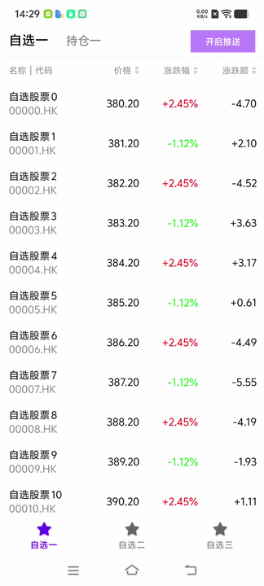
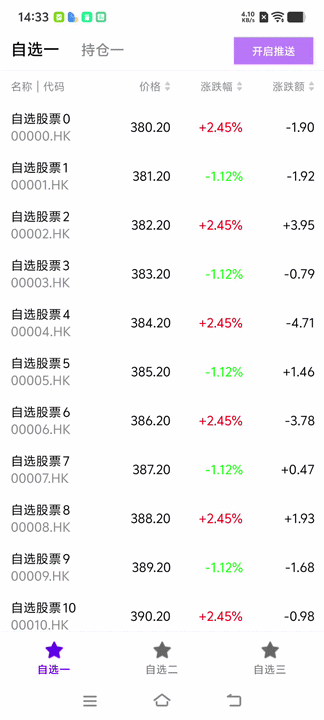
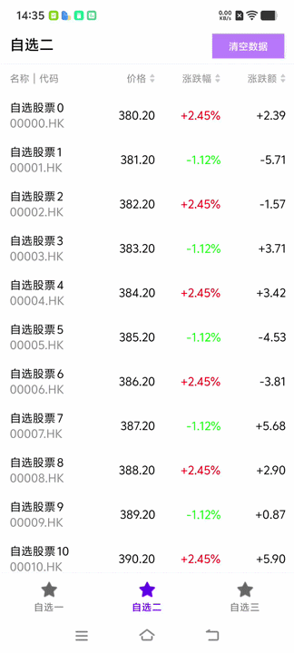
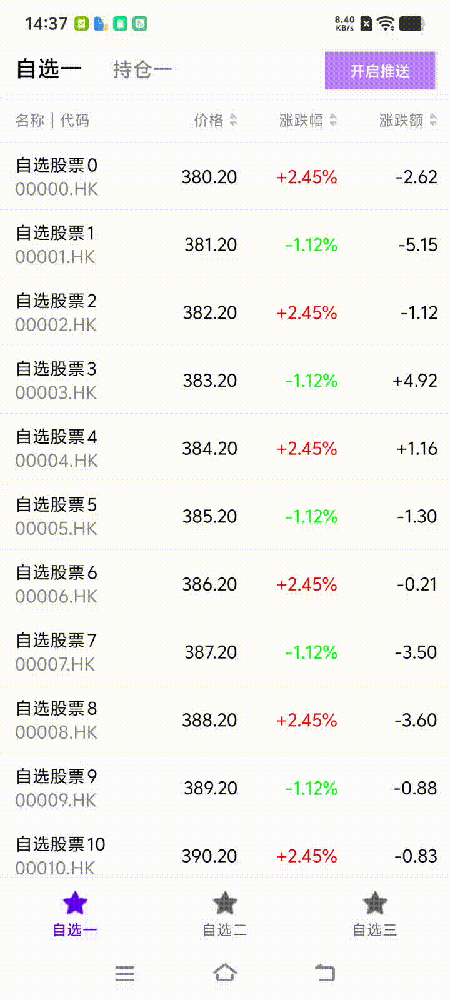
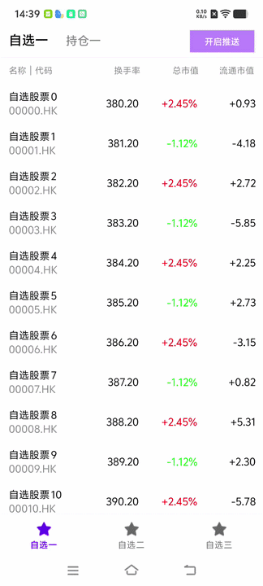
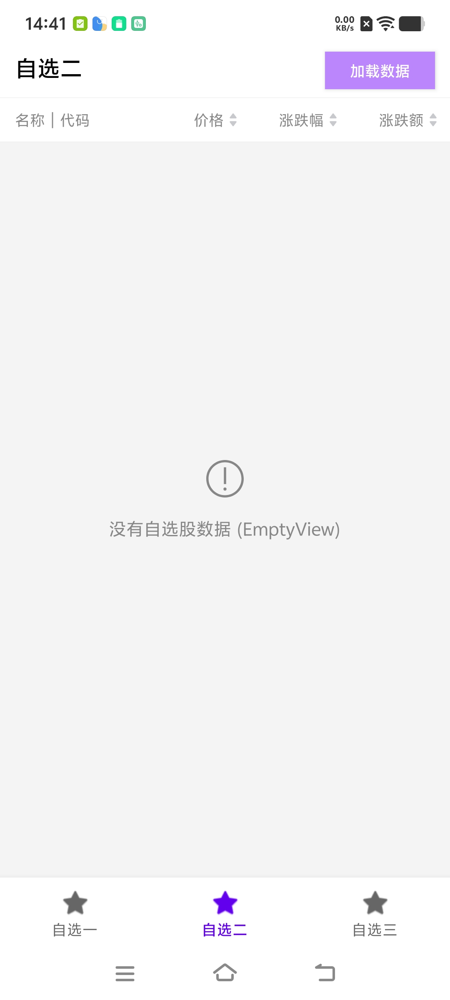
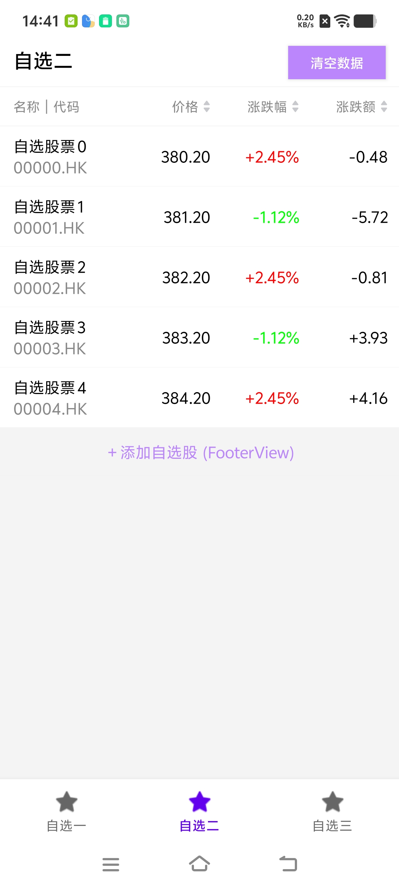

# FrozenColumnList

[](https://jitpack.io/#viifo/FrozenColumnList)

[中文](https://github.com/viifo/FrozenColumnList/blob/master/README.md)  | [English](https://github.com/viifo/FrozenColumnList/blob/master/README_EN.md)

Efficiently create a stock watchlist with a fixed left column and a swipeable right column to view more columns.


## Preview

|                 Sliding effect                  |               Horizontal rebound                |
| :---------------------------------------------: | :---------------------------------------------: |
|  |  |
|           **With refresh layout  1**            |           **With refresh layout  2**            |
|  |  |
|            **Item update animation**            |              **Linked ViewPager**               |
|  |  |
|                 **Empty view**                  |                 **Footer view**                 |
|  |  |


## Usage

1. Add the following to the repositories section of the `build.gradle` file in the root directory.

   ```groovy
   dependencyResolutionManagement {
     	repositoriesMode.set(RepositoriesMode.FAIL_ON_PROJECT_REPOS)
       repositories {
           ...
           maven { setUrl("https://jitpack.io") }
       }
   }
   ```

2. Add a gradle dependency.

   ```groovy
   dependencies {
       implementation("com.github.viifo:FrozenColumnList:1.0.0")
   }
   ```

3. Add `FrozenColumnList` in the layout xml.

   ```xml
   <!-- Table Header -->
   <com.viifo.frozencolumnlist.FrozenColumnHeader
       android:id="@+id/list_header"
       android:layout_width="match_parent"
       android:layout_height="35dp"
       android:background="@color/white"
       app:fchItemGravity="center_vertical"/>
   
   <!-- Stock List -->
   <com.viifo.frozencolumnlist.FrozenColumnList
       android:id="@+id/stock_list"
       android:layout_width="match_parent"
       android:layout_height="match_parent"/>
   ```

4. A custom  [ColumnProvider](https://github.com/viifo/FrozenColumnList/blob/master/frozencolumnlist/src/main/java/com/viifo/frozencolumnlist/provider/ColumnProvider.kt) tells the `FrozenColumnList` how to configure the list headers and items. See [StockColumnProvider](https://github.com/viifo/FrozenColumnList/blob/master/demo/src/main/java/com/viifo/frozencolumnlist/demo/ui/StockColumnProvider.kt) for an example.

   ```kotlin
   class CustomProvider : DefaultColumnProvider<StockModel> {
   
       override fun createItemRowFrozenViews(
           parent: ViewGroup,
           viewType: Int,
           size: Int
       ): List<View> {
           // To create a list of child views with fixed columns, 
           // please use code to create a view tree to improve performance.
           val paddingVertical = parent.context.dp2px(8)
           return (0 until size).map {
               LinearLayoutCompat(parent.context).apply {
                   orientation = LinearLayoutCompat.VERTICAL
                   gravity = Gravity.START or Gravity.CENTER_VERTICAL
                   setBackgroundColor(Color.WHITE)
                   addView(AppCompatTextView(parent.context).also {
                       it.id = R.id.item_tv_name
                       it.setTextColor(Color.BLACK)
                       it.setTextSize(TypedValue.COMPLEX_UNIT_SP, 14f)
                   })
                   addView(AppCompatTextView(parent.context).also {
                       it.id = R.id.item_tv_code
                       it.setTextColor(Color.GRAY)
                       it.setTextSize(TypedValue.COMPLEX_UNIT_SP, 14f)
                   })
                   setPadding(
                       parent.context.dp2px(12),
                       paddingVertical,
                       parent.context.dp2px(8),
                       paddingVertical
                   )
               }
           }
       }
   
       override fun createItemRowScrollableViews(
           parent: ViewGroup,
           viewType: Int,
           size: Int
       ): List<View> {
           // To create a list of child views with scrollable columns, 
         	// please use code to create a view tree to improve performance.
           return (0 until size).map { index ->
               AppCompatTextView(parent.context).also {
                   it.id = your_view_id
                   it.setTextColor(Color.BLACK)
                   it.setTextSize(TypedValue.COMPLEX_UNIT_SP, 14f)
                   it.gravity = Gravity.END or Gravity.CENTER_VERTICAL
                   it.setPadding(
                       0,
                       0,
                       parent.context.dp2px(if (index == size - 1) 14 else 10),
                       0
                   )
                   it.setBackgroundColor(Color.WHITE)
               }
           }
       }
   
       override fun bindItemRowFrozenViews(
           holder: GenericStockAdapter.GenericViewHolder<StockModel>,
           data: StockModel,
           payloads: List<Any?>
       ) {
           // Bind fixed column data to the corresponding View
           holder.setText(your_view_id, data.name)
           // ...
       }
   
       override fun bindItemRowScrollableViews(
           holder: GenericStockAdapter.GenericViewHolder<StockModel>,
           data: StockModel,
           payloads: List<Any?>
       ) {
           // Bind scrollable column data to the corresponding View
           TODO("Not yet implemented")
       }
   }
   ```

5. Configure `FrozenColumnHeader`.

   ```kotlin
   // Set the ColumnProvider for FrozenColumnHeader
   frozenColumnHeader?.setProvider(customProvider)
   // Header Click Event Listener
   frozenColumnHeader?.onHeaderClickListener = { view, index ->
       // eg. sorting by table header
   }
   ```

6. Configure `FrozenColumnList`, where the [StockItemAnimator](https://github.com/viifo/FrozenColumnList/blob/master/demo/src/main/java/com/viifo/frozencolumnlist/demo/ui/StockItemAnimator.kt) is used to add items and update the blinking effect based on the stock's price movement.

   ```kotlin
   // Set the ColumnProvider for FrozenColumnList
   frozenColumnList.setProvider(provider)
   // Bind header view (synchronize header scrolling)
   frozenColumnList.attachHeader(frozenColumnHeader)
   // Configure the item update animation to add a blinking effect based on the stock's price fluctuations.
   frozenColumnList.setItemAnimator(StockItemAnimator(requireContext()))
   // Add Item divider decoration
   frozenColumnList.addItemDecoration(
       BoundDividerDecoration(
           context = context,
           dividerColor = context?.getColor(R.color.divider_2) ?: Color.GRAY
       )
   )
   // Set up item click event listener
   frozenColumnList.setOnItemClickListener { view, position, itemViewType ->
       // ....
   }
   ```

7. Set list data.

   ```kotlin
   // Update header data
   frozenColumnHeader?.setHeaderData(headerList)
   // Update list data
   frozenColumnList.submitList(stockList)
   ```


## Attribute table

### FrozenColumnList Attrs

|              name              |  format   |                         description                          |
| :----------------------------: | :-------: | :----------------------------------------------------------: |
|       fclItemFrozenWidth       | dimension | The item freezes (fixes) the view width, with a default value of 120dp. It prioritizes the width provided by the ColumnProvider. |
|          fclItemWidth          | dimension | The width of the non-frozen (scrollable) view for the item, with a default value of 80dp. The width provided by the ColumnProvider is preferred. |
|      fclOverScrollDamping      |   float   | The over-limit rebound damping coefficient has a default value of 0.6f. |
| fclOverScrollAnimatorThreshold | dimension | The threshold for triggering the out-of-bounds bounce animation is 10dp, with a default value of 10dp. |
|    fclMaxOverScrollDistance    | dimension | Maximum out-of-bounds bounce distance, default value is 80dp. |


### FrozenColumnList Method

|                  name                  |           format           |                         description                          |
| :------------------------------------: | :------------------------: | :----------------------------------------------------------: |
|         canScrollHorizontally          |          boolean           | Whether to allow horizontal scrolling, the default value is true. |
|              getProvider               |       ColumnProvider       |              Get the settings of ColumnProvider              |
|              setProvider               |       ColumnProvider       |               Set up the column view provider.               |
|              attachHeader              |     FrozenColumnHeader     |       Bind header view (synchronize header scrolling)        |
|               submitList               | List<out FrozenColumnData> |                        Set list data                         |
|          addChildClickViewIds          |         vararg Int         | Add a collection of View IDs for clicking the child View of the Item. |
|      setOnItemChildClickListener       |          callback          |   Set up a click event listener for the item's child view.   |
|         setOnItemClickListener         |          callback          |               Set up item click event listener               |
|    setOnEmptyViewChildClickListener    |          callback          | Set up a click event listener for the child view of an EmptyView. |
|      setOnEmptyViewClickListener       |          callback          |         Set up a click event listener for EmptyView          |
|   setOnFooterViewChildClickListener    |          callback          | Set up a click event listener for the FooterView child view. |
|      setOnFooterViewClickListener      |          callback          |      Set up a click event listener for the FooterView.       |
|            syncHeaderOffset            |     FrozenColumnHeader     |          Manually synchronize header scroll offset           |
|         updateHorizontalOffset         |            Int             |               Update horizontal scroll offset                |
|      addHorizontalScrollListener       |          callback          |                Add horizontal scroll listener                |
|     removeHorizontalScrollListener     |          callback          |              Remove horizontal scroll listener               |
|     setSpringBackAnimatorProvider      | SpringBackAnimatorProvider |      Set up the out-of-bounds bounce animation provider      |
|      getFrozenColumnLayoutManager      | FrozenColumnLayoutManager  |                      Get Layout Manager                      |
|         getFrozenColumnAdapter         |    GenericStockAdapter     |                       Get list adapter                       |
|                getData                 | List<out FrozenColumnData> |             Get the list of currently bound data             |
|                getItem                 |    out FrozenColumnData    |         Retrieve Item data from a specified location         |
| setupViewPager2TouchConflictResolution |          boolean           | Enable ViewPager2 nesting conflict resolution. The default is false. Enabling this will disable horizontal bounce. |


### ColumnProvider Method

|             name             |                format                 |                         description                          |
| :--------------------------: | :-----------------------------------: | :----------------------------------------------------------: |
|          getAdapter          |          GenericStockAdapter          | Specify the Adapter, the default is [GenericStockAdapter](https://github.com/viifo/FrozenColumnList/blob/master/frozencolumnlist/src/main/java/com/viifo/frozencolumnlist/layout/GenericStockAdapter.kt) |
|       createEmptyView        |                 View                  |                     Create an empty view                     |
|       createFooterView       |                 View                  |                      Create bottom view                      |
|       getColumnWidths        |               List<Int>               | Get the width of each column (including fixed and scrollable columns, in pixels). |
|      createFrozenHeader      |              List<View>               |     Create a list of header subviews with fixed columns.     |
|    createScrollableHeader    |              List<View>               |          Create a scrollable list header View list           |
|     bindFrozenHeaderView     |       (View, FrozenHeaderData)        | Bind fixed list header data to the corresponding table header View |
|   bindScrollableHeaderView   |       (View, FrozenHeaderData)        | Bind scrollable list header data to the corresponding list header View |
|    createItemRowContainer    |               ViewGroup               |          Create a row View container for each item.          |
|   createItemRowFrozenViews   |              List<View>               | Create a list of child views with a fixed column for each item. |
| createItemRowScrollableViews |              List<View>               | Create a list of child views for each item's scrollable column. |
|    bindItemRowFrozenViews    | (GenericViewHolder<T>, T,List<Any?> ) | Bind the fixed column data for each item to the corresponding View. |
|  bindItemRowScrollableViews  | (GenericViewHolder<T>, T,List<Any?> ) | Bind the scrollable column data for each item to the corresponding View. |


### FrozenColumnHeader Attrs

|        name        |  format   |                         description                          |
| :----------------: | :-------: | :----------------------------------------------------------: |
| fchItemFullHeight  |  boolean  | Whether the item view occupies the full height; the default value is true. |
| fchItemFrozenWidth | dimension | The item freezes (fixes) the view width, with a default value of 120dp. It prioritizes the width provided by the ColumnProvider. |
|    fchItemWidth    | dimension | The width of the non-frozen (scrollable) view for the item, with a default value of 80dp. The width provided by the ColumnProvider is preferred. |
|   fchItemGravity   |   enum    |  The alignment of the item view; the default value is start  |


### FrozenColumnHeader Method

|            name            |         format         |                         description                          |
| :------------------------: | :--------------------: | :----------------------------------------------------------: |
|        setProvider         |     ColumnProvider     |               Set up the column view provider.               |
|       setHeaderData        | List<FrozenHeaderData> |                    Set table header data                     |
|       refreshHeader        | (Int,FrozenHeaderData) |                  Refresh single header data                  |
| onHorizontalScrollListener |        callback        | Callback during horizontal swiping, used to synchronize the list. |
|   onHeaderClickListener    |        callback        |                   Header Item Click Event                    |
|         headerData         | List<FrozenHeaderData> |                         Header data                          |


## ProGuard

This library does't use serialization and deserialization, JNI, reflection, so there is no need to add confusing filtering code.


## License

```
Copyright 2021 viifo

Licensed under the Apache License, Version 2.0 (the "License");
you may not use this file except in compliance with the License.
You may obtain a copy of the License at

   http://www.apache.org/licenses/LICENSE-2.0

Unless required by applicable law or agreed to in writing, software
distributed under the License is distributed on an "AS IS" BASIS,
WITHOUT WARRANTIES OR CONDITIONS OF ANY KIND, either express or implied.
See the License for the specific language governing permissions and
limitations under the License.
```

